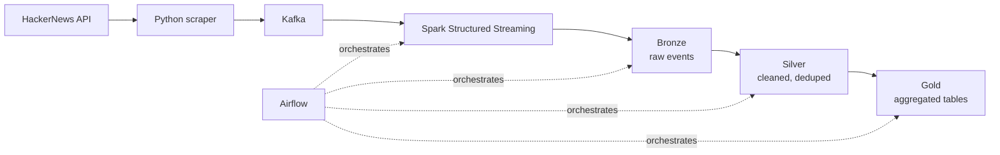

# Real-time data platform (Kafka + Spark + Airflow)

End-to-end streaming pipeline that ingests live HackerNews activity and turns it into analytics-ready tables using a medallion (Bronze/Silver/Gold) lakehouse pattern.

## Why this exists

Most portfolio data pipelines stop at "I moved data from A to B." This project is built to mirror what a production streaming pipeline actually has to handle: out-of-order events, schema drift, replayability, and a clean separation between raw, cleaned, and analytics-ready data — so a BI tool or analyst can query the Gold layer directly without ever touching raw events.

## Architecture



**Flow:** the scraper polls the HackerNews API and publishes raw events to a Kafka topic. Spark Structured Streaming consumes that topic continuously and writes through three lakehouse layers — Bronze (raw, immutable), Silver (cleaned, deduplicated, schema-enforced), Gold (aggregated tables for analytics/BI). Airflow schedules and monitors the batch stages of this pipeline.

## What the Gold layer produces

The Gold layer outputs aggregated, query-ready tables — e.g. story/comment volume over time, top contributors, engagement trends — intended to be queried directly by a BI tool (Metabase, Superset, etc.) or a notebook, without needing to touch Bronze or Silver.

> Replace this section with your actual Gold schema/table names and a sample query or screenshot once finalized — that's the single most convincing addition you can make here.

## Tech stack

| Layer | Tool |
|---|---|
| Ingestion | Python, Kafka |
| Processing | Apache Spark (Structured Streaming) |
| Storage | Lakehouse (Bronze/Silver/Gold) |
| Orchestration | Apache Airflow |
| Infra | Docker |

## Project structure

```
data-platform/
├── dags/          # Airflow DAGs
├── scraper/       # HackerNews API scraper
├── spark/         # Spark streaming jobs
├── spark_jobs/    # (merge with spark/ — see Known issues)
└── docker-compose.yml
```

## Running locally

```bash
# 1. Start infrastructure (Kafka, Spark, Airflow)
docker-compose up -d

# 2. Start the scraper
python scraper/hackernews_scraper.py

# 3. Trigger the Airflow DAG
# Open the Airflow UI at localhost:8080 and trigger the DAG manually,
# or let it run on its schedule.
```

## Known issues / next steps

- [ ] Merge `spark/` and `spark_jobs/` into a single directory
- [ ] Add data quality checks between Silver and Gold (e.g. Great Expectations or dbt tests)
- [ ] Add a sample screenshot of the Airflow DAG graph and a Gold table query result
- [ ] Add unit tests for the scraper and Spark transformations
- [ ] Document expected throughput / latency once benchmarked

## License

MIT
